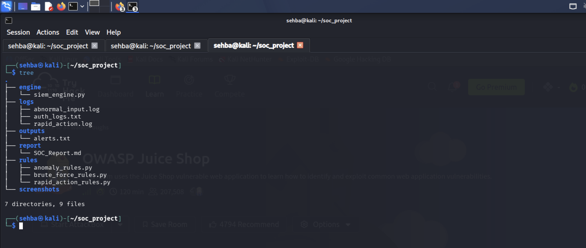

# SOC Detection Engine (Mini SIEM Simulation)

A Python-based Security Operations Center (SOC) simulation engine that detects common attack patterns using log analysis and rule-based detection.

---

## Overview

This project simulates a lightweight SIEM system by:

- Ingesting logs from multiple sources
- Applying detection rules
- Identifying suspicious behavior
- Generating structured alerts
- Storing results for analysis

---

## Security Objectives

- Detect brute force authentication attempts
- Identify abnormal or malicious input patterns
- Monitor rapid or automated request behavior
- Generate structured security alerts for analysis


---


## Architecture

## 🏗️ System Architecture

```text
Logs (Input Sources)
        ↓
Detection Engine (siem_engine.py)
        ↓
Rule-Based Analysis (SOC Rules)
        ↓
Alert Generation System
        ↓
SOC Report / Outputs

```
---


</> Markdown
## 📁 Project Structure



🔍 Detection Modules

🔴 1. Brute Force Detection

- Detects repeated failed authentication attempts from a single source IP.


Logic:

- Counts FAIL occurrences
- Triggers alert if threshold exceeded

** Outcome:**

Identifies potential password-guessing attacks


🟡 2. Abnormal Input Detection

Detects suspicious payloads in input logs.

Examples detected:

<script> injection attempts
SQL injection patterns (OR 1=1, --)
Excessively long input strings

Outcome:

Identifies potential XSS / Injection attacks
⚡ 3. Rapid Action Detection

Detects unusually high-frequency request activity.

Behavior simulated:

Multiple rapid REQUEST events from same IP

Outcome:

Identifies bot-like or automated traffic patterns

▶️ How to Run
PYTHONPATH=. python3 engine/siem_engine.py


📊 Sample Output


📸 Screenshots
🔹 Engine Execution
